### Publishing real-time financial data feeds using Amazon Managed Streaming for Kafka

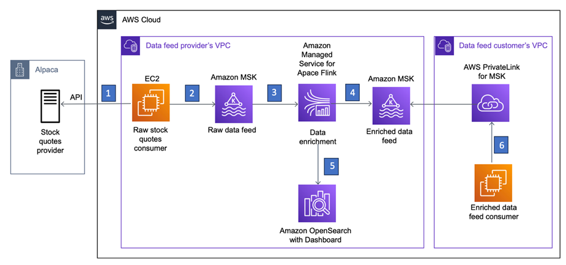

## Prerequisites

To deploy this solution, you need to do the following: 
 
•	Create an AWS account if you do not already have one and log in. Then create an IAM user with full admin permissions as described at Create an Administrator User. Log out and log back into the AWS console as this IAM admin user.
NOTE: Ensure you have two AWS accounts to proceed with this blog.

•	Install the AWS Command Line Interface (AWS CLI) on your local development machine and create a profile for the admin user as described at Set Up the AWS CLI.   

•	Create a Key Pair named “awsBlog-dev-app-us-east-1” in both accounts to enable connections for our producer and consumer EC2 instances. If you change the Key Pair's name, ensure you update the “keyPairName” parameter in the parameters.py file located at “dataFeedMsk\dataFeedMsk-awsBlog-repo-us-east-1\dataFeedMsk\parameters.py”.

•	Create an S3 bucket named “awsblog-dev-app-us-east-1-ACCOUNT-NUMBER” and update the “s3BucketName” parameter in the parameters.py file accordingly. Upload the provided “flink-app-1.0.jar” file, placed at the following link. Create a folder python-scripts. Now unzip kafka-blog.zip and place the file “script/ec2-script-live.py” and “script/requirement.txt” at python-scripts.

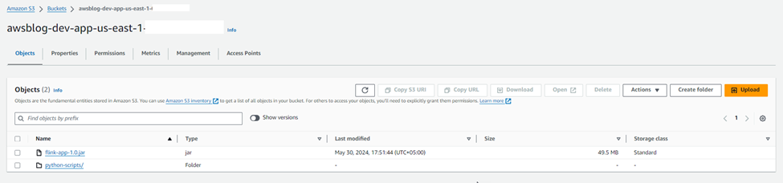

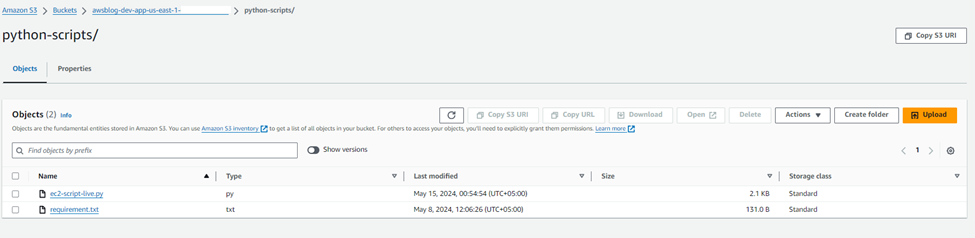

•	Install the latest version of AWS CDK globally
npm install -g aws-cdk@latest

## Infrastructure Automation
 
AWS CDK is used to develop parameterized scripts for building the necessary infrastructure. These scripts include various services required for the infrastructure setup.
 
1.	Amazon VPC and Security Groups
2.	KMS Keys
3.	Secrets Manager
4.	SSM Parameter Stores
5.	CloudWatch Log Groups
6.	MSK Cluster
7.	IAM Roles
8.	EC2 Instances
9.	OpenSearch Domain
10.	Apache Flink Application

*Deploying the Infrastructure* 
 
1.	On your development machine, clone the repo and install the Python packages. 
git clone {public_repository_url} 
2.	Install the necessary libraries
cd dataFeedMSK\dataFeedMsk-awsBlog-repo-us-east-1
pip install –r requirements.txt [Run this command in Powershell]
3.	Set the environment variables
set CDK_DEFAULT_ACCOUNT={your_aws_account_id}
set CDK_DEFAULT_REGION=us-east-1
4.	Bootstrap the first AWS environment (Producer AWS Account)
cdk bootstrap aws://{your_aws_account_id}/{your_aws_region} [Run this command in CMD]	
5.	Once bootstrapped, the configuration of the "CDK Toolkit" stack will be displayed as follows within the Cloud Formation console.

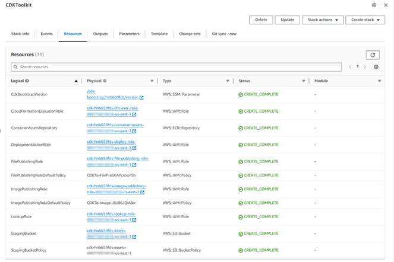

3.	This step involves creating a VPC and deploying the Amazon MSK cluster within it. Additionally, it sets up an Apache Flink application, establishes an OpenSearch domain, and launches a new EC2 instance to handle the retrieval of raw exchange data.
•	Make sure that the enableSaslScramClientAuth, enableClusterConfig, and enableClusterPolicy parameters in the parameters.py file are set to False. 
•	Update the mskCrossAccountId parameter in the parameters.py file with your AWS cross-account ID.
Ensure that you are on the correct path: dataFeedMsk\dataFeedMsk-awsBlog-repo-us-east-1 
cdk deploy --all --app "python app1.py" --profile {your_profile_name}

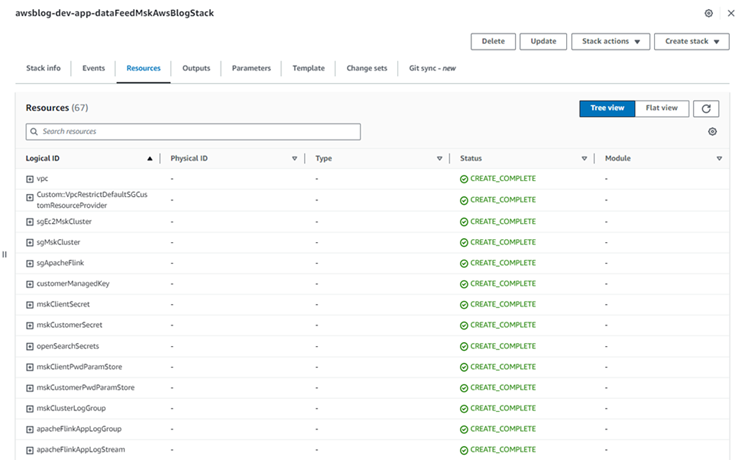

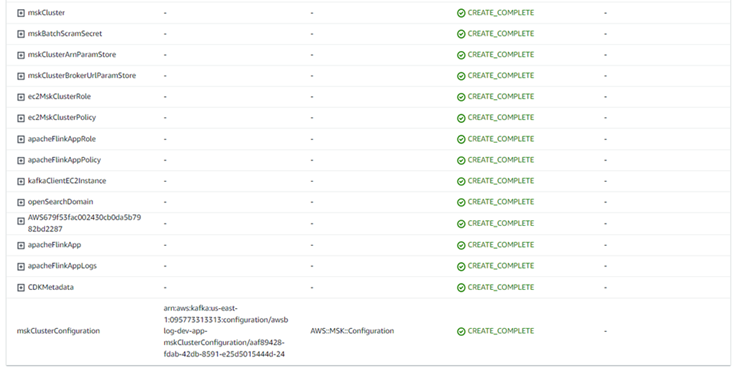

NOTE: This step can take up to 45-60 minutes. 
4.	Now, set the enableSaslScramClientAuth, enableClusterConfig, and enableClusterPolicy parameters in the parameters.py file to True. 
 
This step will enable the SASL/SCRAM client authentication, Cluster configuration and PrivateLink.
Ensure that you are on the correct path: dataFeedMsk\dataFeedMsk-awsBlog-repo-us-east-1
cdk deploy --all --app "python app1.py" --profile {your_profile_name}

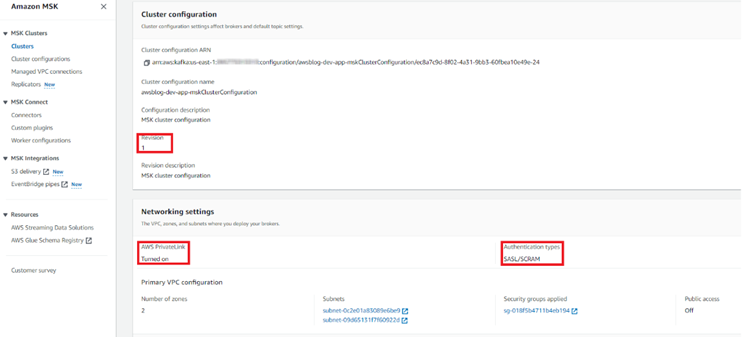

Note: Below are the steps to configure the infrastructure in the second account

Before deploying the cross-account stack, we need to modify some parameters in the parameters.py file. 
•	Log in to the AWS Management Console and navigate to MSK.
•	Copy the MSK Cluster ARN and update the “mskClusterArn” parameter value in the parameters.py file. 

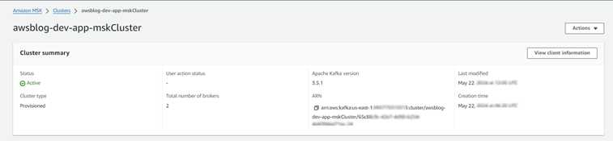

•	If you haven't changed the name of the MSK cluster, there's no need to update the “mskClusterName” parameter. If you have, update it with your own MSK Cluster name. 
•	Now navigate to Systems Manager (SSM) Parameter Store.
•	Copy the value of the “blogAws-dev-mskCustomerPwd-ssmParamStore” parameter, and update the “mskCustomerPwdParamStoreValue” parameter in the parameters.py file. 
•	Then, check the value of the parameter named "getAzIdsParamStore" and make a note of these two values.
•	Switch to your second AWS account (Consumer Account) and go to the Resource Access Manager (RAM) service through the console.
•	In the RAM console, click on "Resource Access Manager" at the top left of the page.

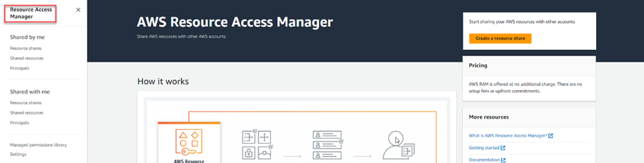

•	At the bottom right, you will see a table listing AZ Names and AZ IDs.

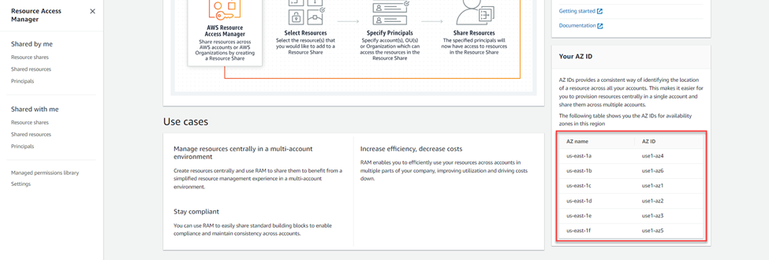

•	Compare the AZ IDs from the SSM parameter store with the AZ IDs in this table.
•	Identify the corresponding AZ Names for the matching AZ IDs.
•	Open the parameters.py file and insert these AZ Names into the variables “crossAccountAz1” and “crossAccountAz2”.

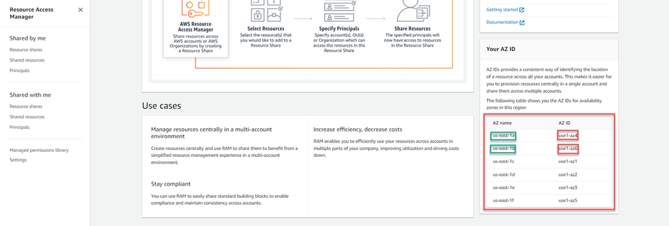

For example, in the SSM Parameter Store, the values are "use1-az4" and "use1-az6". When you switch to the second account's RAM and compare, you find that these values correspond to the AZ names "us-east-1a" and "us-east-1b". You need to update the parameters.py file with these AZ names by setting crossAccountAz1 to "us-east-1a" and crossAccountAz2 to "us-east-1b".

Note: Ensure that the Availability Zone IDs for both of your accounts are the same.

1.	Now, setup the AWS CLI credentials of your consumer AWS Account Set the environment variables
set CDK_DEFAULT_ACCOUNT={your_aws_account_id}
set CDK_DEFAULT_REGION=us-east-1
2.	Bootstrap the first AWS environment (Consumer AWS Account)
cdk bootstrap aws://{your_aws_account_id}/{your_aws_region} [Run this command in CMD]
Once bootstrapped, the configuration of the "CDK Toolkit" stack will be displayed as follows within the Cloud Formation console.

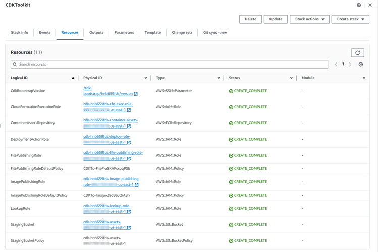

3.	In the final iteration, we will deploy the cross-account resources, which include the VPC, Security Groups, IAM Roles, and MSK Cluster VPC Connection.
Ensure that you are on the correct path: dataFeedMsk\dataFeedMsk-awsBlog-repo-us-east-1
cdk deploy --all --app "python app2.py" --profile {your_profile_name}

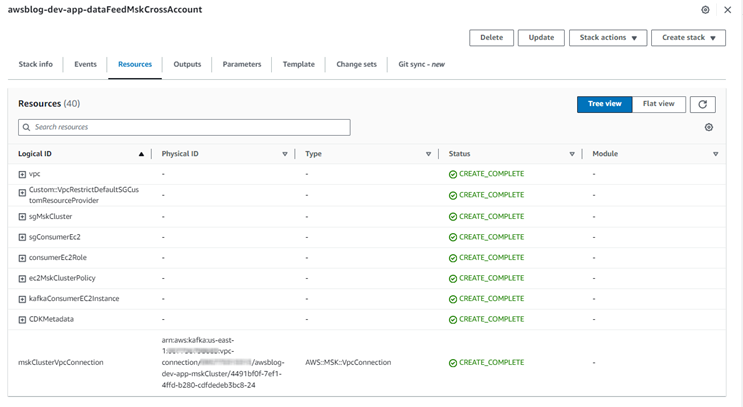

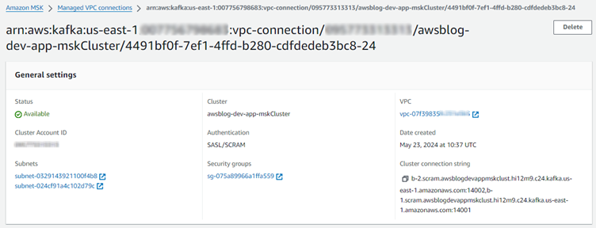