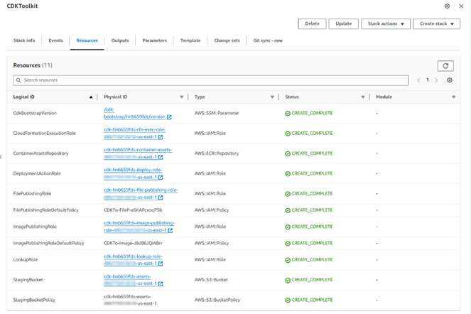

1.	On your development machine, clone the repo and install the Python packages. 
git clone {public_repository_url} 
2.	Install the necessary libraries
cd dataFeedMSK\dataFeedMsk-awsBlog-repo-us-east-1
pip install –r requirements.txt [Run this command in Powershell]
3.	Set the environment variables
set CDK_DEFAULT_ACCOUNT={your_aws_account_id}
set CDK_DEFAULT_REGION=us-east-1
4.	Bootstrap the first AWS environment (Producer AWS Account)
cdk bootstrap aws://{your_aws_account_id}/{your_aws_region} [Run this command in CMD]	
5.	Once bootstrapped, the configuration of the "CDK Toolkit" stack will be displayed as follows within the Cloud Formation console.

3.	This step involves creating a VPC and deploying the Amazon MSK cluster within it. Additionally, it sets up an Apache Flink application, establishes an OpenSearch domain, and launches a new EC2 instance to handle the retrieval of raw exchange data.
•	Make sure that the enableSaslScramClientAuth, enableClusterConfig, and enableClusterPolicy parameters in the parameters.py file are set to False. 
•	Update the mskCrossAccountId parameter in the parameters.py file with your AWS cross-account ID.
Ensure that you are on the correct path: dataFeedMsk\dataFeedMsk-awsBlog-repo-us-east-1 
cdk deploy --all --app "python app1.py" --profile {your_profile_name}
 
 
 

NOTE: This step can take up to 45-60 minutes. 
4.	Now, set the enableSaslScramClientAuth, enableClusterConfig, and enableClusterPolicy parameters in the parameters.py file to True. 
 
This step will enable the SASL/SCRAM client authentication, Cluster configuration and PrivateLink.
Ensure that you are on the correct path: dataFeedMsk\dataFeedMsk-awsBlog-repo-us-east-1
